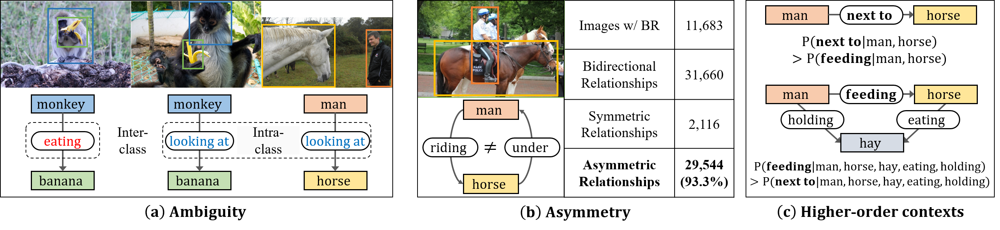
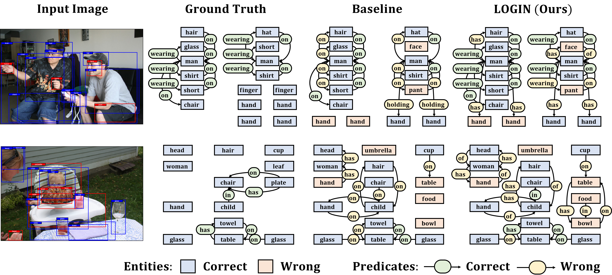

# Local-to-Global Interaction Networks (LOGIN)

| :warning: WARNING                |
|:---------------------------------|
| **This repo is not done yet...**  |

-------------------------------------------------------------------

Implementation of ["Tackling the Challenges in Scene Graph Generation with Local-to-Global Interactions"](https://arxiv.org/pdf/2106.08543.pdf).

In this work, we seek new insights into the underlying challenges of the Scene Graph Generation (SGG) task. Quantitative and qualitative analysis of the Visual Genome dataset implies -- **1) Ambiguity**: even if inter-object relationship contains the same object (or predicate), they may not be visually or semantically similar, **2) Asymmetry**: despite the nature of the relationship that embodied the direction, it was not well addressed in previous studies, and **3) Higher-order contexts**: leveraging the identities of certain graph elements can help to generate accurate scene graphs.

Motivated by the analysis, we design a novel SGG framework, **Local-to-Global Interaction Networks (LOGIN)**. *Locally*, interactions extract the essence between three instances - subject, object, and background - while baking direction awareness into the network by constraining the input order. *Globally*, interactions encode the contexts between every graph components -- nodes and edges. Also we introduce Attract & Repel loss which finely adjusts predicate embeddings. Our framework enables predicting the scene graph in a local-to-global manner by design, leveraging the possible complementariness. To quantify how much LOGIN is aware of relational direction, we propose a new diagnostic task called Bidirectional Relationship Classification (BRC). We see that LOGIN can successfully distinguish relational direction than existing methods (in BRC task) while showing state-of-the-art results on the Visual Genome benchmark (in SGG task).

## Citation

    @article{woo2022tackling,
      title={Tackling the Challenges in Scene Graph Generation with Local-to-Global Interactions},
      author={Woo, Sangmin and Noh, Junhyug and Kim, Kangil},
      journal={IEEE Transactions on Neural Networks and Learning Systems},
      year={2022},
      publisher={IEEE}
    }

## Acknowledgement
We appreciate much the nicely organized codes developed by [Scene-Graph-Benchmark](https://github.com/KaihuaTang/Scene-Graph-Benchmark.pytorch) and [Graph R-CNN](https://github.com/sangminwoo/graph-rcnn.pytorch). Our codebase is built mostly based on them.
